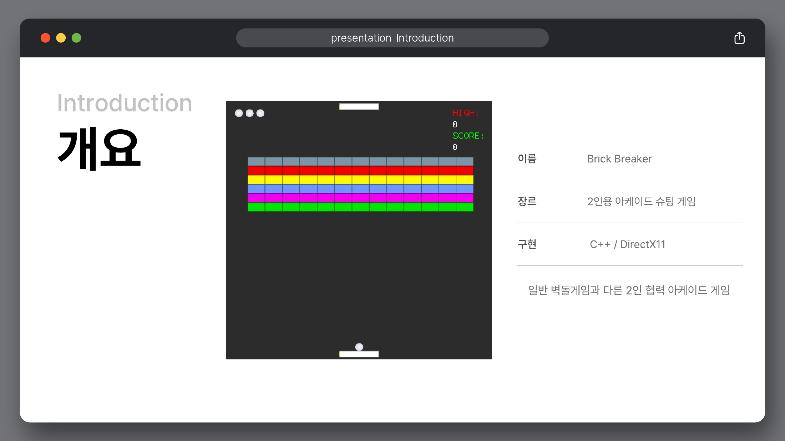
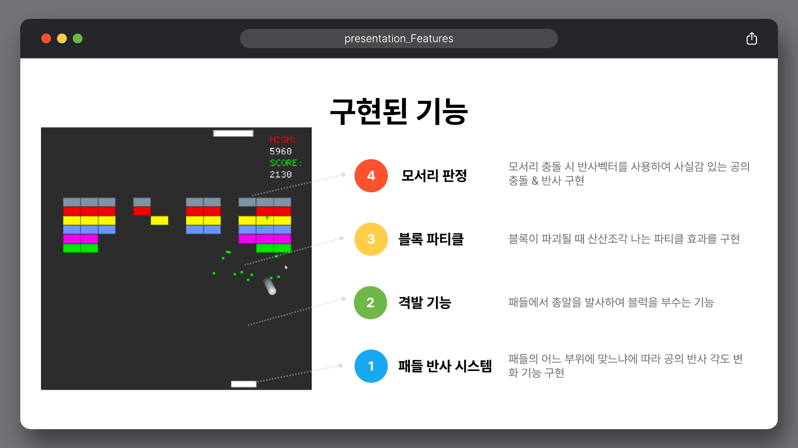

# Brick Breaker - Week 1 Game Jam

> **C++20 · Win32 · DirectX 11 · HLSL · ImGui · FMOD · 2-Player Cooperative Arcade**

`Brick Breaker`는 화면 위와 아래의 두 플레이어가 하나의 생명을 공유하며 스테이지를 공략하는 2인 협동 벽돌깨기 게임입니다.

일반적인 벽돌깨기의 패들 반사 규칙에 상·하단 듀얼 패들, 격발 시스템, 멀티볼과 강화·약화 아이템을 결합했습니다. DirectX 11로 기본 도형과 게임 화면을 렌더링하고, 충돌 위치에 따른 반사 각도 변화와 모서리 반사, 파티클, 속도 기반 잔상 등을 직접 구현했습니다.



이 문서는 발표·설명 자료와 현재 저장소의 C++·HLSL 코드에서 확인되는 구현 범위를 기준으로 작성했습니다. 자료와 코드가 다른 부분은 코드 동작을 우선하며, 차이가 플레이에 영향을 주는 경우에는 제한 사항에 별도로 기록했습니다.

## 프로젝트 개요

| 항목 | 내용 |
| --- | --- |
| 게임명 | **Brick Breaker** |
| 장르 | 2인 협동 아케이드 슈팅 / 벽돌깨기 |
| 플랫폼 | Windows PC |
| 개발 형태 | KRAFTON Game Tech Lab 1주차 게임잼 |
| 언어 | C++20, HLSL |
| 그래픽스 | Win32, DirectX 11 |
| UI | Dear ImGui |
| 오디오 | FMOD |
| 입력 | 키보드, Windows.Gaming.Input 게임패드 |

### 팀 구성

| 팀 | 팀원 |
| --- | --- |
| Team 8 | 김형도, 김호준, 조상현, 김선명 |

발표 자료에서 개인별 담당 영역은 구분되어 있지 않아 팀원 정보만 기록했습니다.

## 게임 규칙

두 플레이어는 화면 아래와 위에 배치된 패들을 조작합니다. 공을 받아 벽돌을 파괴하고, 패들에 장착된 총알을 사용해 원하는 열의 벽돌을 직접 공격할 수 있습니다.

- 두 플레이어는 최대 3개의 생명을 공유합니다.
- 모든 공이 화면 밖으로 이탈하면 공을 다시 생성하고 생명 1개를 차감합니다.
- 파괴 가능한 벽돌을 모두 제거하면 다음 스테이지로 진행합니다.
- 벽돌 파괴 시 점수를 얻고 50% 확률로 아이템이 생성됩니다.
- 게임 오버 또는 최종 클리어 시 점수를 `Score.dat`와 비교해 최고 점수를 갱신합니다.

### 의도한 게임 흐름

```text
Title
  └─ Game Start
       └─ Stage 1
            └─ Stage Clear
                 └─ Stage 2
                      └─ Stage Clear
                           └─ Stage 3
                                └─ Final Clear

플레이 중 모든 공 이탈
  ├─ 남은 생명 있음 → 생명 감소 → 하단 패들에서 공 재생성
  └─ 남은 생명 없음 → Game Over → Restart 또는 Title
```

현재 Stage 3의 완료 조건에는 파괴 불가 블록 처리 문제가 있으며, 자세한 내용은 [현재 구현의 제한 사항](#현재-구현의-제한-사항)에 정리했습니다.

## 구현 요약

| 영역 | 구현 내용 |
| --- | --- |
| Game Flow | Title, InGame, Clear Scene과 스테이지 클리어·게임 오버 모달 |
| Cooperative Play | 상·하단 듀얼 패들, 공유 생명 3개, 공·아이템 공동 대응 |
| Collision | 원과 AABB의 최근접점 검사, 면·모서리 구분, 반사 벡터 계산 |
| Paddle Reflection | 패들의 충돌 위치에 따라 공의 수평 속도와 반사 각도 변경 |
| Stage | 정적 그리드 데이터로 구성한 3개 스테이지와 3종 블록 |
| Shooting | 패들별 총알 수량, 발사 간격, 좌·우 교대 발사와 진행 방향별 피격 검사 |
| Item | 생명·멀티볼·점수·패들·공 속도·총알에 영향을 주는 10종 아이템 |
| Presentation | 블록 파티클, 공 잔상, 충돌 Flash, 블록 Wipe 효과 |
| Audio | FMOD 기반 BGM, 충돌, 파괴, 피해, 시작, 승리, 게임 오버 사운드 |
| Data | 로컬 파일을 이용한 최고 점수 저장과 불러오기 |



## 1. 상·하단 듀얼 패들과 공유 생명

`UGameScene`은 하단의 1P 패들과 상단의 2P 패들을 생성하고, 하나의 `UGameManager`에서 점수와 생명을 관리합니다. 한쪽 플레이어만 별도의 목숨을 잃는 구조가 아니라 두 플레이어가 최대 3개의 생명을 공유합니다.

게임 시작과 생명 차감 후의 공은 하단 패들에 부착된 상태로 생성됩니다. 1P가 공을 발사하면 두 플레이어가 각자의 패들과 총알을 이용해 같은 스테이지를 공략합니다.

생명이 차감되거나 다음 스테이지로 넘어갈 때는 다음 아이템 효과를 초기화합니다.

- 패들 속도: `1.0`
- 패들 크기: `0.15`
- 현재 필드의 아이템 제거
- 공을 하단 패들 기준으로 다시 배치

## 2. 충돌과 반사 시스템

### 원과 AABB의 최근접점 검사

공과 패들·블록의 충돌은 원의 중심에서 AABB 내부의 가장 가까운 점을 구하고, 그 점과 원 중심 사이의 거리를 반지름과 비교하는 방식으로 판정합니다.

```text
Closest Point = clamp(Ball Position, AABB Min, AABB Max)
Collision     = distance(Ball Position, Closest Point) < Ball Radius
```

최근접점의 위치를 이용해 충돌이 가로 면, 세로 면, 모서리 중 어디에서 발생했는지도 함께 분류합니다.

### 모서리 반사

모서리 충돌에서는 충돌 지점에서 공 중심을 향하는 법선 벡터를 만들고 다음 반사식을 적용합니다.

```text
R = V - 2(V · N)N
```

- `V`: 충돌 직전 진행 방향
- `N`: 충돌 지점의 정규화된 법선
- `R`: 반사 후 진행 방향

반사 후 수직 성분이 지나치게 작아 공이 수평으로만 왕복하지 않도록 최소 수직 성분을 보정하고, 공을 충돌 표면 밖으로 이동시켜 연속 충돌을 줄였습니다.

### 인접 블록을 고려한 충돌 축 보정

그리드에서 서로 붙어 있는 블록 사이를 공이 통과할 때 두 블록에 동시에 반응하면 진행 방향이 불안정해질 수 있습니다. `UGameScene`은 충돌한 블록의 상·하·좌·우 인접 칸을 확인해 실제로 노출된 축을 판별하고, 이미 처리한 인접 블록은 중복 반사를 건너뜁니다.

### 패들 위치에 따른 가변 반사

공이 패들 중앙에서 얼마나 떨어진 위치에 충돌했는지 비율로 계산해 수평 속도에 반영합니다. 중앙에 가까우면 수직에 가까운 궤적이 되고, 가장자리에 가까울수록 수평 성분이 커지므로 플레이어가 공의 다음 진행 방향에 개입할 수 있습니다.

## 3. 스테이지와 블록

스테이지는 `Stage.cpp`의 정적 2차원 배열로 정의합니다. 배열의 각 값은 빈 공간, 색상별 일반 블록, 강화 블록, 파괴 불가 블록을 나타내며 실행 시 `UBlock` 객체로 변환됩니다.

| 스테이지 | 그리드 크기 | 구성 특징 |
| ---: | ---: | --- |
| 1 | 6 × 13 | 색상별 일반 블록과 상단 강화 블록 |
| 2 | 13 × 13 | 대각선 형태의 일반 블록과 강화 블록 |
| 3 | 15 × 13 | 일반 블록 사이에 파괴 불가 블록 배치 |

### 블록 종류

| 블록 | 코드상 특성 |
| --- | --- |
| Normal | 한 번의 유효한 공격으로 파괴되며 색상에 따라 점수 제공 |
| Hard | 내구도 2를 가지며 첫 공격에는 피격 효과만 표시하고 두 번째 공격에 파괴 |
| Immortal | 체력이 감소하지 않으며 피격 시 Wipe 효과만 재생 |

공과 총알은 동일한 `TakeDamage` 경로를 이용합니다. 파괴 가능한 블록의 체력이 0이 되면 점수를 추가하고, 아이템 생성 여부를 결정한 뒤 파티클을 발생시킵니다.

## 4. 아이템 시스템

블록을 파괴하면 50% 확률로 아이템이 생성됩니다. 아이템은 공이 이동하던 수직 방향의 반대쪽으로 떨어져 해당 방향의 플레이어가 받을 수 있도록 구성했습니다. 생성된 아이템은 두 패들과 충돌할 수 있으며, 획득한 패들을 `IItemEffectReceiver`로 사용해 효과를 적용합니다.

| 아이템 | 실제 코드 기준 효과 |
| --- | --- |
| AddLife | 공유 생명 +1, 최대 3 |
| MultiBall | 현재 공 중 하나를 기준으로 공 2개 추가 |
| ScoreBonus | 점수 +100 |
| PaddleExpand | 획득한 패들 크기 ×1.2 |
| PaddleShrink | 획득한 패들 크기 ×0.8 |
| PaddleSpeedUp | 획득한 패들 속도 ×1.2 |
| PaddleSpeedDown | 획득한 패들 속도 ×0.8 |
| BallSpeedUp | 현재 모든 공의 속도 ×1.5 |
| BallSpeedDown | 현재 모든 공의 속도 ×0.7 |
| AddBullet | 획득한 패들의 총알 +5 |

패들 크기는 `0.05`에서 `0.3`, 이동 속도는 `0.3`에서 `5.0` 사이로 제한해 아이템을 반복해서 획득하더라도 조작 가능한 범위를 유지합니다.

설명 문서에는 공 속도 아이템이 각각 ×1.2와 ×0.8로 기재되어 있지만, 현재 `ItemLibrary.cpp`에서는 ×1.5와 ×0.7을 사용하므로 표에는 코드 값을 반영했습니다.

## 5. 격발 시스템

각 패들은 게임 시작 시 총알 5개를 보유하며, 최대 30개의 `UBullet` 객체를 미리 생성해 재사용합니다.

- 발사 간격: 0.5초
- 발사 위치: 패들 왼쪽과 오른쪽 끝을 번갈아 사용
- 1P 총알: 화면 위쪽으로 이동
- 2P 총알: 화면 아래쪽으로 이동
- 블록 피격: 총알이 속한 열에서 진행 방향상 가장 먼저 만나는 활성 블록 공격
- 총알 보충: `AddBullet` 아이템 획득 시 5발 추가

총알과 공이 같은 블록 피해 함수를 사용하므로 일반 블록, 강화 블록, 파괴 불가 블록의 규칙이 동일하게 유지됩니다.

## 6. 렌더링과 게임 연출

### DirectX 11 렌더링

`URenderer`는 Direct3D 11 Device, Device Context, Swap Chain, Render Target과 Rasterizer State를 초기화합니다. 실행 시 `ShaderW0.hlsl`을 `vs_5_0`과 `ps_5_0`으로 컴파일하고, 위치·크기·색상·효과 값을 상수 버퍼로 전달합니다.

공은 24개 세그먼트로 구성한 원형 메시를 사용하며, 패들·블록·총알·아이템은 각 도형의 정점 버퍼로 렌더링합니다. 게임 좌표는 화면 중심을 원점으로 하는 정규화 좌표계 `-1.0 ~ 1.0`을 사용합니다.

### 블록 파티클 풀

게임 Scene은 200개의 `UParticle`을 미리 생성합니다. 블록 하나가 파괴될 때 비활성 파티클을 최대 15개 가져와 블록 색상과 무작위 속도로 방출합니다. 수명이 끝난 파티클은 제거하지 않고 다시 비활성 상태로 돌려 다음 파괴 효과에 재사용합니다.

### 속도 기반 공 잔상

공의 속도가 `1.0`보다 커지면 일정 주기로 이전 위치를 저장하고, 오래된 위치일수록 낮은 알파값으로 원을 다시 그려 잔상을 표현합니다. 속도가 낮아지면 저장된 잔상을 순차적으로 제거합니다.

### Flash와 Wipe

HLSL 픽셀 셰이더는 충돌 시 공 주변의 Flash 효과와 블록을 가로지르는 대각선 Wipe 효과를 계산합니다. 파괴 불가 블록도 공격에 반응하도록 체력 감소 대신 Wipe 값을 갱신합니다.

### UI, 오디오와 점수 저장

ImGui로 타이틀 메뉴, 현재 점수, 최고 점수, 스테이지 클리어, 게임 오버와 최종 결과 화면을 구성했습니다. FMOD는 BGM과 충돌·벽돌 파괴·피해·승리·게임 오버 효과음을 재생합니다.

최고 점수는 실행 경로의 `Score.dat`에 정수로 저장합니다. 기존 점수보다 높은 결과를 달성했을 때만 파일을 갱신합니다.

## 구조

```text
main.cpp
├─ URenderer
│  ├─ Direct3D 11 Device / Swap Chain
│  ├─ ShaderW0.hlsl
│  └─ Primitive Vertex Buffers / Constant Buffer
├─ USceneManager
│  ├─ UTitleScene
│  ├─ UGameScene
│  └─ UClearScene
├─ UInputManager
│  └─ UGamepadManager
└─ USoundManager

UGameScene
├─ UGameManager       - 공유 생명과 점수
├─ UBar × 2           - 패들과 총알 풀
├─ UBall List         - 공과 멀티볼
├─ UBlock Grid        - 스테이지 블록
├─ UItemManager       - 아이템 생성·수명·충돌
└─ UParticlePool      - 블록 파괴 파티클 재사용
```

`UGameObject`와 `UScene`을 공통 기반으로 사용하고, 입력·Scene·게임 상태·오디오를 Singleton Manager로 분리했습니다. 게임 오브젝트는 `Update`와 `Render` 인터페이스를 통해 메인 루프에 참여합니다.

## 조작법

아래 표는 발표 자료가 아니라 현재 입력 코드 기준입니다.

| 플레이어 | 입력 | 기능 |
| --- | --- | --- |
| 1P - Bottom | `←` / `→` | 하단 패들 이동 |
| 1P - Bottom | `↑` | 하단 패들에 부착된 공 발사 |
| 1P - Bottom | `↓` | 총알 발사 |
| 2P - Top | `A` / `D` | 상단 패들 이동 |
| 2P - Top | `S` | 총알 발사 |
| 2P - Top | Gamepad Left Stick | 게임패드 연결 시 상단 패들 이동 |
| 2P - Top | Gamepad `A` | 게임패드 연결 시 총알 발사 |

게임패드가 연결되어 있으면 2P 이동과 격발은 게임패드 입력을 우선합니다. 발표·설명 자료에는 2P의 `X` 키를 공 발사로 안내하지만, 현재 코드에는 `X` 입력 처리가 없고 공은 하단 패들에서만 생성됩니다.

## 빌드 및 실행

### 배포본 실행

상위 폴더의 [`Brick Breaker.zip`](<../Brick Breaker.zip>)에는 다음 실행 파일과 런타임 리소스가 포함되어 있습니다.

```text
Release/
├─ JungleEntranceExam.exe
├─ fmod.dll
├─ ShaderW0.hlsl
├─ bgm.wav / hit.wav / brick.wav / ...
└─ imgui.ini
```

1. ZIP 파일을 원하는 위치에 압축 해제합니다.
2. `Release/JungleEntranceExam.exe`를 실행합니다.
3. `fmod.dll`, `ShaderW0.hlsl`과 음원 파일은 실행 파일과 같은 폴더에 유지합니다.

### 소스 빌드

#### 요구 환경

- Windows 10 이상
- Visual Studio 2022
- MSVC v143 Toolset
- Windows 10 SDK
- C++20
- DirectX 11 / Shader Model 5.0
- FMOD Core API의 x64 `fmod_vc.lib`와 `fmod.dll`

#### 빌드 절차

1. `JungleEntranceExam.sln`을 Visual Studio 2022에서 엽니다.
2. 플랫폼을 `x64`, 구성을 `Debug` 또는 `Release`로 선택합니다.
3. FMOD 파일을 프로젝트가 기대하는 다음 경로에 배치하거나 프로젝트 설정의 경로를 수정합니다.

```text
JungleEntranceExam/FMOD/inc/
JungleEntranceExam/FMOD/lib/fmod_vc.lib
```

4. 빌드 후 실행 파일이 `fmod.dll`, `ShaderW0.hlsl`과 음원 파일을 찾을 수 있도록 작업 디렉터리를 설정합니다.

현재 저장소에는 FMOD 헤더만 포함되어 있으며 `FMOD/lib/fmod_vc.lib`와 런타임 `fmod.dll`은 없습니다. 소스 빌드에는 별도의 FMOD SDK가 필요하고, 실행만 필요한 경우에는 배포 ZIP을 사용할 수 있습니다.

## 현재 구현 범위와 제한 사항

- 메인 루프는 목표 60 FPS와 고정 `deltaTime = 1/60`을 사용합니다. 실제 프레임이 목표보다 느릴 때 경과 시간에 맞추는 가변 시간 보정은 구현되어 있지 않습니다.
- 발표 자료에서는 화면 위나 아래로 공을 놓치면 생명이 감소한다고 설명하지만, 현재 공은 위쪽 화면 경계에서 자동 반사됩니다. 따라서 실제 공 소실과 생명 차감은 모든 공이 하단으로 이탈했을 때 발생합니다.
- 발표 자료의 2P `X` 공 발사 입력은 현재 코드에 연결되어 있지 않습니다. 공의 최초 생성과 재생성은 하단 패들 기준이며 1P의 `↑` 입력으로 시작합니다.
- Stage 3에는 파괴 불가 블록이 배치되어 있지만 스테이지 종료 검사인 `bIsBrickEmpty()`는 모든 활성 블록을 검사합니다. 파괴 불가 블록도 활성 상태로 남기 때문에 현재 코드 그대로는 Stage 3의 최종 클리어 전환에 도달할 수 없습니다.
- 공과 공 사이의 충돌 함수는 정의되어 있으나 현재 `UGameScene`의 갱신 경로에서는 호출되지 않아 멀티볼끼리는 물리적으로 반응하지 않습니다.
- Scene과 게임 오브젝트의 소유권이 Raw Pointer와 Singleton에 의존하며, Scene 재초기화 과정의 중복 초기화와 해제 순서를 체계적으로 관리하는 별도 수명 시스템은 없습니다.
- 아이템 렌더링은 프레임마다 정점 버퍼를 생성하고 해제하므로, 아이템 수가 많아질 경우 재사용 가능한 버퍼 방식보다 비용이 증가할 수 있습니다.
- 현재 소스 트리만으로는 FMOD 링크 파일이 부족해 바로 빌드할 수 없습니다. 배포 ZIP에는 실행에 필요한 `fmod.dll`이 포함되어 있습니다.

## 향후 개선 방향

발표 당시에는 다음 확장 방향을 제안했습니다.

- Stage 3 이후 상단과 하단의 난이도·블록 배치가 서로 다른 비대칭 스테이지 추가
- 협동 플레이를 기반으로 상대 진영에 공을 넣는 경쟁 규칙 추가

현재 코드 기준으로는 다음 항목을 먼저 수정해야 안정적인 확장이 가능합니다.

- 파괴 불가 블록을 제외한 스테이지 완료 조건 정의
- 상단 실점 처리와 2P 공 발사 입력 연결
- 실제 경과 시간을 사용하는 게임 루프
- Scene·게임 오브젝트 소유권 정리
- 공통 정점 버퍼 재사용과 리소스 수명 관리

## 참고 자료

- [Brick Breaker 발표 자료](<../Brick Breaker 발표 자료.pdf>)
- [Brick Breaker 설명 문서](<../Brick Breaker 설명 문서.pdf>)
- [Brick Breaker 실행 파일](<../Brick Breaker.zip>)

