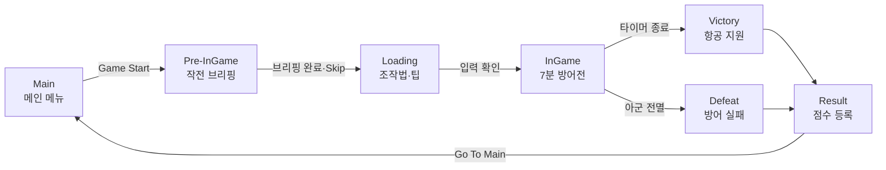

# Snajper — Week 14 Final Game Jam

> **Custom Engine · C++20 · DirectX 11 · Lua · Sniper FPS · Ballistics · Combat AI · Kill Cam · RmlUi · FMOD · PhysX · NvCloth**

`Snajper`는 14주 동안 제작한 자체 게임 엔진 **Apple Jam Engine**으로 완성한 장거리 저격 액션 게임입니다.

플레이어는 전선 후방의 저격수가 되어 아군과 교전 중인 적을 식별하고, 탄도와 바람을 고려한 정밀 사격으로 아군을 지원합니다. 제한 시간 7분 동안 아군이 생존하면 항공 지원이 도착해 승리하고, 모든 아군이 전투 불능 상태가 되면 패배합니다.

게임의 프레임 단위 계산과 충돌 판정은 C++에서 처리하고, 게임 상태·웨이브·점수·UI·무전·컷신과 같은 규칙 및 연출은 Lua에서 제어하도록 역할을 분리했습니다. 이전 주차에 구현한 애니메이션, 물리, 파티클, UI, 오디오, 시퀀스와 후처리 시스템을 하나의 플레이 가능한 게임으로 통합한 것이 이번 프로젝트의 핵심입니다.

이 문서는 14주차 과제의 학습 목표와 현재 저장소의 C++ 코드, `Content/Script` Lua, Scene·Prefab, UI 및 빌드 스크립트에서 확인되는 최종 구현 범위를 기준으로 작성했습니다.

## 학습 목표

- 자체 엔진에서 시작·진행·승패·결과·재진입으로 이어지는 완결된 게임 흐름을 구현한다.
- 14주 동안 구현한 렌더링, 애니메이션, 물리, UI, 오디오와 게임플레이 기능을 실제 게임에 통합한다.
- 프레임 단위 계산이 필요한 기능은 C++, 반복 수정이 잦은 게임 규칙과 연출은 Lua로 분리한다.
- Lua 상태 머신과 이벤트 버스를 이용해 Scene, UI, Audio, Combat 시스템 사이의 결합도를 낮춘다.
- 키보드·마우스와 게임패드를 모두 지원하고, 로딩 화면에서 조작법을 안내한다.
- Editor 빌드와 Standalone Game·Release 패키지를 구성하고 실행 가능한 결과물을 만든다.
- 게임 화면과 크레딧에 KRAFTON Game Tech Lab 과정 및 팀 정보를 포함한다.

## 프로젝트 개요

| 항목 | 내용 |
| --- | --- |
| 게임명 | **Snajper** |
| 장르 | FPS / Sniping Action |
| 플랫폼 | Windows PC |
| 엔진 | Apple Jam Engine — Win32 + DirectX 11 기반 자체 엔진 |
| 언어 | C++20, Lua |
| 플레이 시간 | 7분 |
| 개발 기간 | 2026.06.04 ~ 2026.06.09 |
| 팀 | KRAFTON Game Tech Lab 3 · Week 14 · Team 7 |
| 핵심 목표 | 항공 지원이 도착할 때까지 아군 전선을 저격으로 지원 |

### 팀 구성

| 구분 | 담당자 | 담당 영역 |
| --- | --- | --- |
| PM | 김형도 | Player, Sense of Hitting |
| LD | 이상훈 | Level Design |
| AI | 권현수 | Enemy AI |
| SYS | 양현석 | UI, Sequence, Game System |

팀 구성과 담당 영역은 게임 내 Credits 화면에 표시되는 내용을 기준으로 정리했습니다.

## 구현 요약

| 영역 | 구현 내용 |
| --- | --- |
| Game Flow | Main → Pre-InGame → Loading → InGame → Victory·Defeat → Result 상태와 Scene 전환 |
| Lua Architecture | `GeneralManager`, 상태별 Manager와 `EventBus`를 이용한 게임 규칙·연출 제어 |
| Sniper Player | 이동·시점, 스코프, 단계별 확대, 숨 참기, 조준 흔들림, 반동, 재장전과 탄종 변경 |
| Ballistics | 실제 발사체, 중력·항력·측풍, 영점 조절, Substep·Sweep 충돌과 Physics Asset 피격 판정 |
| Damage & Score | 아군·적군 식별, 부위별 피해, 방탄·관통·도탄, 헤드샷·관통·오인 사격 점수 반영 |
| Combat AI | Cover Node·Slot·Lane을 이용한 전투 배치, 역할별 이동·공격과 Lua 애니메이션 연동 |
| Wave | 2개 스포너, 3종 적 Prefab, 0~240초 동안 5개 웨이브 순차 생성 |
| Presentation | Bullet Kill Cam, Rail Rig, Slow Motion, DOF, Shockwave, 혈흔·폭발 파티클 |
| UI & Audio | RmlUi HUD·메뉴·결과 화면, FMOD BGM·SFX·3D Audio, 상황별 무전과 자막 |
| Data | 설정·닉네임·경기 결과·로컬 점수판을 JSON으로 저장 |
| Packaging | Debug·Game·Release 구성, Manifest 생성, Dry Run과 Launch Smoke Test 지원 |

## 전체 게임 흐름



`SceneManager`는 상태 전환 요청을 큐에 저장하고, Fade Out → Scene Load → 상태 진입 → HUD 교체 → Fade In 순서로 처리합니다. 전환할 Scene의 유효성을 먼저 확인한 뒤 기존 World를 정리하며, 비동기 로딩이 끝나지 않는 경우를 위한 Timeout도 둡니다.

결과 화면에는 즉시 같은 Scene을 다시 불러오는 버튼 대신 `Go To Main`을 제공합니다. 따라서 한 경기의 재진입은 **Result → Main → Game Start** 흐름으로 처리됩니다.

## 1. C++와 Lua의 책임 분리

### 실행 경계

| C++ — Engine·Frame Critical | Lua — Rule·Presentation |
| --- | --- |
| 입력 Snapshot과 Pawn 이동·시점 | 게임 상태와 Scene 전환 정책 |
| 스코프 FOV, 조준 흔들림과 반동 | 7분 타이머와 승리·패배 규칙 |
| 탄도 적분과 Sweep 충돌 | 웨이브 시간표와 Prefab Spawn |
| Physics Asset 기반 피격 부위 판정 | 점수 계산과 결과 저장 |
| 관통·도탄·방탄과 Damage 적용 | UI 상태와 HUD 데이터 전달 |
| Cover Graph와 전투 Agent 갱신 | 무전·자막·BGM·효과음 제어 |
| Kill Cam Director와 Rail Rig | 킬캠 Profile·Timing·연출 선택 |
| RmlUi·FMOD·Actor Sequence API | 이벤트에 따른 UI·Audio·Sequence 호출 |

탄도나 충돌처럼 매 프레임 다수의 객체를 처리하며 일관된 결과가 필요한 기능은 C++에 두었습니다. 반대로 상태 전환, 웨이브 수치, 점수와 연출 Timing은 Lua에서 구성해 재빌드 없이 조정할 수 있도록 했습니다.

### GeneralManager와 EventBus

`GeneralManager.lua`는 각 Scene에 배치된 `ULuaScriptComponent`에서 실행되며 다음 Manager를 초기화하고 갱신합니다.

1. `DataManager`
2. `AudioManager`
3. `RadioManager`
4. `EffectManager`
5. `UIManager`
6. `CutSceneManager`
7. `InGameManager`
8. `SceneManager`

Manager 사이의 통신은 `EventBus.lua`의 `Subscribe`, `Publish`, `Unsubscribe`, `ClearOwner`를 사용합니다. 이벤트 발행 중 Listener 목록이 바뀌어도 안전하도록 Snapshot을 순회하며, Listener 호출은 `pcall`로 격리해 하나의 Lua 오류가 전체 이벤트 전달을 중단하지 않도록 했습니다.

World가 교체되면 Manager의 Scene 종속 상태를 초기화하고 새 `GeneralManager`가 현재 Scene 이름으로 시작 상태를 복원합니다. 이를 통해 Scene마다 같은 관리 코드를 재사용하면서 상태 전환을 이어갑니다.

## 2. 저격수 플레이어

### FPS 입력과 카메라

`ASniperPawn`은 키보드·마우스와 게임패드 Mapping을 함께 등록하고, 엔진의 입력 Snapshot을 한 프레임의 Player Input으로 변환합니다.

- WASD 또는 게임패드 오른쪽 스틱으로 제한된 저격 지점 안에서 이동합니다.
- 마우스 또는 게임패드 왼쪽 스틱으로 시점을 조작합니다.
- Scope 진입 시 FOV와 감도를 현재 배율에 맞춰 보간합니다.
- 설정 화면에서 우클릭 Scope를 Hold 또는 Toggle 방식으로 바꿀 수 있습니다.
- 카메라 Pitch·Yaw와 별도로 조준 흔들림 및 반동 Offset을 합성합니다.

### 스코프, 숨 참기와 반동

스코프 배율을 변경하면 목표 FOV, 조준 감도와 HUD의 확대 정보가 함께 갱신됩니다. Scope Lens는 원형 렌즈 영역과 주변 Blur를 합성해 망원 조준경 형태로 표시합니다.

숨 참기는 게이지를 소비해 조준 흔들림을 감소시킵니다. 게이지가 소진되면 즉시 다시 사용할 수 없고, 회복 상태에서는 흔들림이 일시적으로 증가합니다. UI는 남은 게이지와 경고 상태를 표시하고 심박 효과음을 재생합니다.

발사 시 Weapon의 Recoil이 카메라와 조준 상태에 반영되며, 재장전 시간에는 발사와 Scope 진입을 제한하고 손·무기 애니메이션을 재생합니다.

### 탄종과 영점 조절

무기는 일반탄과 대물탄을 제공합니다.

| 탄종 | 성격 |
| --- | --- |
| 일반탄 | 기본 탄속과 피해량을 사용하는 보병 대응 탄종 |
| 대물탄 | 더 높은 탄속·피해량과 방탄 대상 대응 능력을 가진 탄종 |

영점 거리를 기준으로 총구 방향을 보정하고, 스코프 HUD에 목표 거리·현재 배율·풍향·풍속·상대 측풍을 표시합니다. 플레이어는 탄착점 자체를 화면 중앙으로 보정받는 대신 탄도 정보를 읽고 조준해야 합니다.

## 3. 발사체 기반 탄도 시스템

### 탄도 시뮬레이션

`UBallisticBulletManagerComponent`는 발사된 탄환을 개별 Actor로 Tick하지 않고 Manager에서 연속 배열로 관리합니다. 각 탄환에는 위치, 속도, 수명, 탄종과 발사 정보를 저장하고 다음 순서로 갱신합니다.

```text
Muzzle Transform + Zeroing
        ↓
Initial Velocity
        ↓
Gravity + Drag + Crosswind 적분
        ↓
Substep 구간 분할
        ↓
이전 위치 → 새 위치 Sweep
        ↓
Hit Region / Surface / Team 판정
        ↓
Damage · Penetration · Ricochet · Effect · Lua Event
```

긴 Frame에서도 빠른 탄환이 얇은 물체를 통과하지 않도록 이동 구간을 Substep으로 나누고 각 구간에 Sweep을 수행합니다. 탄환의 Trail과 Tracer는 시뮬레이션 결과를 따라 별도로 표현합니다.

### 바람과 HUD Telemetry

월드 바람을 탄환의 측면 속도 성분으로 환산해 탄도에 반영합니다. UI에는 단순한 월드 풍향뿐 아니라 현재 조준 방향에 대한 상대 측풍을 표시합니다. 이를 통해 같은 바람에서도 플레이어가 바라보는 방향에 따라 서로 다른 탄착 편차가 발생합니다.

### 정밀 피격 판정

Skeletal Mesh 대상은 Physics Asset Shape를 이용해 피격 부위를 판별합니다. 충돌 결과에는 대상, 위치, 법선, 거리, Bone·Body Region과 관통 여부를 담아 Damage, 점수, 애니메이션과 UI가 같은 Hit 정보를 사용하도록 했습니다.

피격 표면과 탄종에 따라 다음 결과를 구분합니다.

- 일반 피격과 부위별 Damage Multiplier
- 방탄 대상의 피해 차단
- 대물탄의 방탄 관통
- 입사각과 재질 조건에 따른 도탄
- 관통 후 잔여 속도·피해량을 적용한 후속 판정
- 피격 Decal, 혈흔 Particle, Hit Notification과 3D Sound

## 4. 점수와 승패 규칙

### 점수 계산

Lua의 `InGameManager`는 C++에서 전달된 `HitInfo`와 처치 이벤트를 조합해 점수를 계산합니다.

| 조건 | 점수 |
| --- | ---: |
| 일반 적 처치 | +100 |
| 헤드샷 처치 | +50 Bonus |
| 관통 처치 | +25 Bonus |
| Kill Cam 조건 달성 | +200 Bonus |
| 아군 처치 | -500 |
| 기본 피격 | +5 |

피격 점수는 Body Region의 `HitInfo` 값이 있으면 해당 값을 우선 사용합니다. 아군을 맞히면 피격 점수의 부호를 반대로 적용하고, 총점은 0 아래로 내려가지 않도록 제한합니다.

### 승리와 패배

- **승리:** 420초의 경기 시간이 끝나 항공 지원이 도착합니다.
- **패배:** Scene에 존재하는 아군 전투 Agent가 모두 사망합니다.

아군 상태는 0.25초 간격으로 검사합니다. Kill Cam이나 다른 Cut Scene이 재생 중일 때 승패 조건이 충족되면 결과를 Queue에 보관하고, 연출이 끝난 뒤 Fade와 함께 Victory 또는 Defeat 상태로 전환합니다.

## 5. 웨이브와 전투 AI

### 5개 웨이브

`EnemyPrefabSpawner.lua`는 InGame 시작 이벤트를 받은 뒤 3종의 적 Prefab을 한 마리씩 1초 간격으로 생성합니다. `InGame.Scene`에는 두 개의 Spawner가 배치되어 있으며 각 Spawner가 동일한 시간표를 독립적으로 수행합니다.

| 시작 시각 | Short Range | Long Range | Assault |
| ---: | ---: | ---: | ---: |
| 0초 | 3 | 1 | 1 |
| 60초 | 6 | 1 | 1 |
| 120초 | 5 | 1 | 4 |
| 180초 | 6 | 2 | 5 |
| 240초 | 8 | 3 | 7 |

후반으로 갈수록 전체 수와 돌격형의 비중을 늘려 아군 전선에 가해지는 압박을 높였습니다. Spawn된 Actor에는 태그를 부여해 Manager와 디버그 기능에서 쉽게 조회할 수 있습니다.

### Cover Graph와 Agent

`InGame.Scene`에는 50개의 `UCombatCoverNodeComponent`와 5개의 초기 `UCombatCoverAgentComponent`가 배치되어 있습니다. `UCombatFlowManagerComponent`는 Node와 Agent를 수집해 전투 흐름을 관리합니다.

- Cover Node의 위치와 연결 관계로 전투 이동 경로를 구성합니다.
- Slot과 Lane을 예약해 여러 Agent가 같은 위치로 겹치는 것을 줄입니다.
- 진영과 역할에 따라 이동, 엄폐, 조준과 공격 상태를 전환합니다.
- 피격과 Suppression 상태를 이동·공격 판단에 반영합니다.
- 사망한 Agent의 예약 정보를 해제해 다른 Agent가 공간을 재사용할 수 있게 합니다.

### Lua 애니메이션·전투 연동

`CombatAI_Anim_Test.lua`는 `UCombatCoverAgentComponent`의 이동·공격·피격·사망 상태를 Animation Graph 변수와 Trigger로 전달합니다.

- Move State와 이동 방향 갱신
- Fire, Hit, Death Trigger 전달
- NPC 사격 시 3D Gun Sound 재생
- 아군 상태 UI를 위한 체력·색상 정보 갱신
- 피격·처치 Event를 `InGameManager`, `EffectManager`, `RadioManager`에 발행
- 사망 후 일정 시간 동안 시체를 가라앉힌 뒤 Actor 정리

## 6. Kill Cam과 피격 연출

### C++ Runtime과 Lua 연출 제어

중요 처치가 발생하면 `ASniperKillCamDirector`가 탄환과 피격 정보를 Snapshot으로 보관하고, `UKillCamRailRigComponent`와 Camera를 구성합니다. Lua의 `CutSceneManager`는 거리와 상황에 맞는 Profile을 고르고 전체 연출 시간을 제어합니다.

```text
Kill 조건 성립
  → World Pause / Time Dilation
  → HUD Letterbox와 Skip 안내
  → Rail Camera가 탄환 진행 경로 추적
  → Impact 구간 Slow Motion
  → DOF·FOV·Shockwave·Sound·Blood Effect
  → Camera·시간·UI 상태 복원
```

Kill Cam은 탄환 비행 구간과 피격 후 구간으로 나뉘며, 기본적으로 약 5초의 이동 연출과 2초의 피격 연출을 사용합니다. 바닥 충돌처럼 유효한 대상 연출이 아닌 경우 Kill Cam을 취소하며, 사용자는 확인 입력으로 연출을 건너뛸 수 있습니다.

### Effect Pool

`EffectManager`는 혈흔 Particle을 Pool로 재사용합니다. 일반 피격과 관통 헤드샷의 Burst 수를 구분하고, Kill Cam 중 발생한 효과는 실제 Impact 시점까지 지연해 Camera 연출과 일치시킵니다. Victory Scene에서는 폭탄 투하 위치에 폭발 Particle과 3D Sound를 생성합니다.

## 7. UI, 오디오와 데이터

### RmlUi 기반 화면 구성

Runtime UI는 RML·RCSS 문서와 Lua의 `UIManager`를 조합합니다.

| 화면 | 주요 기능 |
| --- | --- |
| Main | Game Start, Score Board, Settings, Credits, Exit |
| Pre-InGame | 6장의 작전 브리핑, 자막, 승인 도장, Skip |
| Loading | 조작법, 플레이 팁, 입력 대기 |
| InGame | 타이머, 아군 상태, 스코프, 탄종·잔탄, 숨 참기, Compass, 피격 알림 |
| Pause | Resume, Main, Settings, Controls |
| Result | Victory·Defeat, 최종 점수, 닉네임 입력, 로컬 순위, Main 복귀 |

Scope HUD는 거리, 배율, 풍향, 풍속과 상대 측풍을 표시합니다. Hit Notification은 적·아군 여부, 피격 부위, 관통 여부, 거리와 획득·감점 점수를 하나의 Event 데이터로 표현합니다.

같은 Frame에 UI가 소비한 입력은 게임플레이로 다시 전달하지 않아 버튼을 누른 Mouse 입력이 총기 발사로 이어지는 문제를 방지했습니다. 메뉴 상태에 따라 Cursor 표시와 Mouse Capture Mode도 전환합니다.

### FMOD와 상황별 무전

`AudioManager`는 BGM과 SFX Group Volume을 관리하고, 2D UI Sound와 위치 기반 3D Sound를 구분해 재생합니다. Lua에서는 Sound Handle을 보관해 Scene 전환, Cut Scene과 상태 종료 시 안전하게 정리합니다.

`RadioManager`는 경기 상태와 남은 시간에 따라 무전과 자막을 Queue로 재생합니다.

- 작전 시작 및 7분 후 항공 지원 안내
- 3분·1분·30초 잔여 시간 알림
- 적 처치와 아군 오인 사격 반응
- 아군 저체력 및 최후 생존자 경고
- Victory·Defeat 종료 무전

Cut Scene 중에는 일반 무전을 잠시 보류하고, 현재 연출이 끝난 뒤 이어서 재생합니다.

### 설정과 로컬 점수판

`DataManager`는 `GameData/player_profile.json`에 다음 정보를 저장합니다.

- BGM·SFX Volume
- Scope Hold·Toggle 설정
- Mouse·Gamepad 감도
- 마지막 Nickname과 High Score
- 경기별 Victory·Defeat 및 Score 기록

결과 화면의 Nickname은 영문자와 숫자로 구성된 6~12자로 제한합니다. 저장된 경기 기록은 점수 내림차순으로 정렬하고 한 화면에 8개 Row를 표시합니다. 이 점수판은 네트워크 서비스가 아닌 실행 환경의 로컬 데이터입니다.

## 8. 브리핑, 일시 정지와 승패 시네마틱

### Pre-InGame 브리핑

게임 시작 후 6장의 작전 자료를 순서대로 보여주고 Opening·News Audio와 자막을 동기화합니다. 전체 브리핑이 끝나면 확인 입력을 받아 승인 도장과 효과음을 재생한 뒤 Loading 상태로 이동합니다. 브리핑은 Keyboard와 Gamepad 확인 입력으로 건너뛸 수 있습니다.

### 일시 정지 화면

Q 또는 Gamepad Menu 입력으로 일시 정지하면 전용 Camera로 전환하고 `PauseMenu_Rifle`의 Actor Sequence를 재생합니다. World가 Pause된 동안에도 Raw Delta Time을 이용해 UI와 전환 효과를 갱신합니다.

배경 Cloth는 NvCloth의 Wind 값을 시간에 따라 바꿔 정지 메뉴에서도 움직임을 유지합니다. Resume 시 원래 Camera, 입력 Mode와 World Time을 복원합니다.

### Victory와 Defeat

Victory Scene은 폭격기와 3개의 Cine Camera를 사용합니다. Camera Fade와 DOF를 적용하며 폭탄 30개를 순차 투하하고, 폭발 Particle과 3D Sound를 재생한 뒤 Result HUD를 엽니다.

Defeat Scene은 패배 무전이 끝날 때까지 기다린 뒤 Result HUD를 표시합니다. 무전 완료 Event가 전달되지 않는 상황을 대비해 Timeout 경로도 제공합니다.

## 9. 이전 주차 엔진 기능의 통합

| 엔진 기능 | 14주차 게임에서의 활용 |
| --- | --- |
| GPU Skinning·Animation | 다수의 아군·적 Skeletal Mesh와 이동·사격·피격·사망 Animation |
| Physics Asset·Ragdoll | 탄환의 세부 부위 판정, 피격 반응과 사망 물리 표현 |
| Particle System | 혈흔, 총격과 폭격 Explosion Effect |
| Material·Translucent Pass | Scope, Particle, UI와 반투명 효과 렌더링 |
| Depth of Field | Kill Cam과 Victory Camera의 초점 연출 |
| PhysX | Sweep·Raycast, 충돌, Ragdoll과 전투 물리 |
| NvCloth | Pause Menu 배경 Cloth와 Wind 연출 |
| Actor Sequence | Pause Rifle과 Camera·Actor 기반 시네마틱 제어 |
| RmlUi Runtime UI | Main, Loading, HUD, Pause, Result와 Credits |
| FMOD | BGM, UI SFX, 총성, 무전과 공간 음향 |
| Lua Runtime·Reflection | Manager, 상태 머신, Event와 C++ 객체 Property·Function 접근 |
| Prefab·Tag | 적 Wave Spawn, 역할·Scene 객체 검색과 재사용 |
| JSON Save API | 사용자 설정, Nickname과 로컬 경기 결과 저장 |

14주차에서는 각 기능을 독립적인 기술 Demo로 보여주는 데 그치지 않고, 게임 규칙과 연출에서 실제로 소비하도록 연결했습니다.

## 조작법

| 기능 | 키보드·마우스 | 게임패드 |
| --- | --- | --- |
| 이동 | W / A / S / D | 오른쪽 스틱 |
| 시점·조준 | 마우스 이동 | 왼쪽 스틱 |
| 스코프 | 마우스 오른쪽 버튼 | LT |
| 발사 | 마우스 왼쪽 버튼 | RT |
| 숨 참기 | Shift | LB |
| 확대·축소 | 마우스 휠 | D-Pad 위·아래 |
| 일반탄 | 1 | D-Pad 왼쪽 |
| 대물탄 | 2 | D-Pad 오른쪽 |
| 재장전 | R | X |
| 일시 정지 | Q | Menu |
| 브리핑·로딩 확인 / Kill Cam Skip | Space | Confirm Button |

## 빌드 및 실행

### 요구 환경

- Windows 10·11 x64
- Visual Studio 2022 및 MSVC v143 Toolset
- Windows 10 SDK
- DirectX 11 지원 GPU

프로젝트는 C++20을 사용합니다. 프로젝트 생성용 Python Runtime과 빌드·패키징 스크립트는 저장소에 포함되어 있습니다.

### 프로젝트 생성과 Editor 실행

```bat
GenerateProjectFiles.bat
```

생성된 `KraftonEngine.sln`을 Visual Studio에서 열고 `Debug | x64`를 빌드합니다. 실행 파일은 `KraftonEngine/Bin/Debug/KraftonEngine.exe`에 생성됩니다.

### Standalone Game 빌드

```bat
GameBuild.bat
```

`Game | x64`를 빌드한 뒤 `GameBuild` 폴더에 실행 가능한 패키지를 구성합니다.

```text
GameBuild/
  Play.bat
  PackageManifest.json
  BuildInfo.txt
  Bin/
  Shaders/
  Content/
  Settings/
```

### Release 패키징

```bat
ReleaseBuild.bat
```

`Release | x64` 빌드와 패키징을 연속으로 수행합니다. 배포 Metadata, Symbol 처리, Dry Run과 선택적 Launch Smoke Test가 필요한 경우 다음 스크립트를 사용합니다.

```bat
PackageRelease.bat
```

저장소의 Week 14 검증 기록에는 Debug·Game x64 빌드, Package Dry Run, 실제 패키지 생성과 패키지 실행 Smoke Test의 성공 결과가 남아 있습니다. 전체 패키지는 기록 당시 약 218 MB이며, Manifest에는 파일별 Size와 Hash가 저장됩니다.

## 구현 범위

- 자체 엔진에서 Main부터 Result까지 완결된 게임 상태와 Scene 전환 구현
- C++ 저격 Pawn, Weapon, Ballistic Bullet Manager와 Damage Receiver 구현
- 중력·항력·측풍·영점 조절과 관통·도탄을 포함한 발사체 사격 구현
- Cover Graph 기반 아군·적군 전투와 5개 Wave 구현
- 부위·관통·아군 오인 사격을 반영한 점수 및 Victory·Defeat 구현
- Rail Camera, Slow Motion, DOF와 후처리를 조합한 Kill Cam 구현
- RmlUi 기반 Main·Loading·InGame·Pause·Result UI 구현
- FMOD 기반 BGM·SFX·무전·3D Audio 구현
- Actor Sequence, Particle, Physics, Ragdoll, NvCloth 기능의 게임 통합
- Keyboard·Mouse와 Gamepad 조작 지원
- 로컬 설정·점수 저장과 Game·Release Standalone 패키징 구현

### 제한 사항

- 결과 화면에는 직접적인 Restart 버튼이 없으며, Main으로 돌아간 뒤 Game Start를 선택해 새 경기를 시작합니다.
- 점수판과 사용자 설정은 `GameData/player_profile.json`에 저장되는 로컬 데이터이며 온라인 동기화는 지원하지 않습니다.
- 기획 초안에 포함된 자폭 드론, 박격포·궁극기와 플레이어 직접 피격 패배는 최종 게임 규칙에 포함되지 않았습니다.
- 최종 패배 판정은 별도의 전선 수치가 아니라 모든 아군 `CombatCoverAgent`의 생존 여부를 사용합니다.
- Wave 구성은 Lua에 정의된 고정 시간표이며 동적 난이도 조절이나 플레이 결과 기반 재구성은 제공하지 않습니다.
- 패키징은 실행에 필요한 Content를 복사하는 방식이며 정식 Cook·사용하지 않는 Asset Pruning 과정은 포함하지 않습니다.
- Runtime UI는 게임에 필요한 RML·RCSS 편집과 입력을 지원하지만 고급 IME와 모든 구조를 다루는 완전한 Visual Authoring Workflow는 지원하지 않습니다.
- PhysX·NvCloth 외부 라이브러리의 Debug Symbol이 일부 포함되지 않아 빌드 시 `LNK4099` 경고가 발생할 수 있으나 실행 파일 생성에는 영향을 주지 않습니다.
- `Content/Particle/Script`에 과거 작업본이 중복되어 있지만 런타임의 `FPaths::ScriptDir()`는 `Content/Script`를 사용합니다.

## 참고 문서

- [Game Design Document](Snajper_Game_Design_Document_EN.md)
- [Week 14 Engine Feature Patch Plan](Docs/GameJamFeaturePatchPlan.md)
- [Week 14 Lua API Plan](Docs/LuaAPIBacklogPlan.md)
- [Sniper FPS·Scope·Ballistics Plan](Docs/Sniper_FPS_Scope_Ballistic_ImplementationPlan.md)
- [Sniper Kill Cam Rail Sequence Plan](Docs/SniperKillCamRailSequencePlan.md)
- [Symbol Server Guide](Docs/SymbolServerGuide.md)
