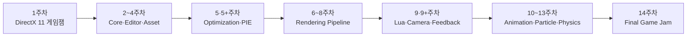

# KRAFTON Jungle GameTechLab - 14주 자체 게임엔진 개발 과정

> **C++20 · Win32 · DirectX 11 · HLSL · Editor · Rendering · Optimization · Lua · Animation · Particle · PhysX · Game Jam**

KRAFTON Jungle GameTechLab에서 14주 동안 진행한 게임엔진 제작 과정과 게임잼 결과물을 정리한 저장소입니다.

1주차에는 DirectX 11로 게임 루프와 충돌·렌더링을 직접 구성한 2인 협동 게임 `Brick Breaker`를 제작했습니다. 이후 2주차부터 13주차까지 엔진 Core, Editor, Asset Pipeline, Rendering, Optimization, Scripting, Animation, Particle, Physics를 단계적으로 구현했고, 14주차에는 자체 엔진으로 장거리 저격 액션 게임 `Snajper`를 완성했습니다.

이 과정은 하나의 저장소를 14주 동안 선형적으로 확장한 프로젝트가 아닙니다. 주차마다 팀과 기반 엔진이 달라졌으며, 새로운 코드베이스에서 과제 목표를 분석하고 기존 구조에 기능을 설계·통합하는 방식으로 진행했습니다. 따라서 이 문서는 **단일 엔진의 버전 기록**보다 **여러 팀 엔진을 경험하며 축적한 기술과 문제 해결 과정**에 초점을 둡니다.

5주차 이후의 추가 과제와 9주차 이후의 추가 과제는 각각 별도의 결과물이므로, 14주 과정 안에 총 16개의 프로젝트 문서가 포함되어 있습니다.

## 과정 개요

| 항목 | 내용 |
| --- | --- |
| 과정 | KRAFTON Jungle GameTechLab 자체 게임엔진 제작 |
| 기간 | 14주 |
| 결과물 | 주차별 프로젝트 16개 - 5+주차·9+주차 포함 |
| 개발 환경 | Windows, Visual Studio 2022 |
| 핵심 언어 | C++20, HLSL, Lua |
| 그래픽스 | Win32, DirectX 11 |
| 개발 방식 | 주차별 팀 프로젝트, 엔진 기능 구현, 최적화잼과 게임잼 |
| 문서 기준 | 과제 명세와 현재 저장소의 실제 구현 코드 교차 검토 |

## 1주차에서 14주차까지

| 구분 | 1주차 `Brick Breaker` | 14주차 `Snajper` |
| --- | --- | --- |
| 목표 | DirectX 11로 플레이 가능한 게임을 직접 완성 | 자체 엔진의 기능을 통합해 최종 게임 완성 |
| 장르 | 2인 협동 아케이드 벽돌깨기 | 장거리 저격 FPS |
| 구조 | 게임 전용 Scene·Manager와 Primitive 중심 구조 | Actor·Component, C++ Runtime, Lua Manager와 EventBus |
| 렌더링 | 기본 도형, HLSL Flash·Wipe, 잔상과 파티클 | Skeletal Animation, Particle, Kill Cam, DoF와 후처리 |
| 게임플레이 | 듀얼 패들, 공유 생명, 아이템, 총알, 3개 스테이지 | 탄도, 바람, 관통·도탄, 전투 AI, 웨이브와 점수 |
| 도구와 데이터 | ImGui UI, 로컬 최고 점수, FMOD | Editor, RmlUi, FMOD 3D Audio, JSON 데이터와 Release Packaging |
| 입력 | 키보드와 일부 게임패드 입력 | 키보드·마우스와 게임패드 |

1주차에는 게임에 필요한 기능을 직접 연결하는 데 집중했다면, 14주차에는 엔진의 범용 시스템과 게임 규칙을 분리하고 여러 엔진 기능을 하나의 실행 흐름으로 통합했습니다.

## 전체 발전 흐름

## 주차별 프로젝트

| 주차 | 유형 | 프로젝트 | 핵심 주제 | 상세 문서 |
| --- | --- | --- | --- | --- |
| 1 | 게임잼 | Brick Breaker | DirectX 11 게임 루프, 2인 협동, 충돌·반사, 아이템과 파티클 | [README](<1주차 게임잼/KraftonJungle_Week1_Team8/README.md>) |
| 2 | 게임엔진 | CustomGameEngine | 3D Math, Camera, Reverse-Z, Picking, Gizmo, Scene과 UObject | [README](<2주차 게임엔진/KraftonJungle_Week2_Team4/README.md>) |
| 3 | 게임엔진 | CO-PASS Engine | Sprite, Texture Atlas, Text, Batch Rendering, AABB와 Scene Manager | [README](<3주차 게임엔진/KraftonJungle3_Week3_Team2/README.md>) |
| 4 | 게임엔진 | CO-PASS Engine | OBJ/MTL Import, Static Mesh, Asset Bake, Multi-Viewport와 OBJ Viewer | [README](<4주차 게임엔진/KraftonJungle_Week4_Team8/README.md>) |
| 5 | 최적화잼 | ZZupEngine | BVH, Frustum·Occlusion Culling, LOD, Render Cache와 Picking 최적화 | [README](<5주차 최적화잼/Jungle_Week5_Team7/README.md>) |
| 5+ | 게임엔진 | NipsEngine | PIE, 다중 World, Actor/Component, Text·Billboard와 Multi-Viewport | [README](<5+주차 게임엔진/Jungle_Week5+_Team7/README.md>) |
| 6 | 게임엔진 | NipsEngine | Projection Decal, Scene Depth, Multi-Pass, Fog, FXAA와 Post Process | [README](<6주차 게임엔진/KraftonJungle_Week6_Team5/README.md>) |
| 7 | 게임엔진 | NipsEngine | Forward Lighting, Uber Shader, Normal Mapping, 2.5D Tile Light Culling | [README](<7주차 게임엔진/KraftonJungle_Week7_Team7/README.md>) |
| 8 | 게임엔진 | NipsEngine | Shadow Mapping, PSM·CSM, PCF·VSM, Shadow Atlas와 Resource Pool | [README](<8주차 게임엔진/Jungle_Week8_Team1/README.md>) |
| 9 | 게임잼 | Drift Salvage | Lua 5.4, sol2, Script Component, Delegate, Collision Event와 게임 상태 | [README](<9주차 게임잼/Jungle_Week9_Team4/README.md>) |
| 9+ | 게임엔진 | Drift Salvage 확장 | Camera Manager, Modifier, Spring Arm, Screen Effect와 Hit Feedback | [README](<9+주차 게임엔진/Jungle_Week9+_Team4/README.md>) |
| 10 | 게임엔진 | LunaticEngine | FBX Import, Skeletal Mesh, Reference Pose, CPU Skinning과 Asset Bake | [README](<10주차 게임엔진/Jungle_Week10_Team3/README.md>) |
| 11 | 게임엔진 | JSEngine | Animation Runtime, State Machine, GPU Skinning, Anim Notify와 개발 도구 | [README](<11주차 게임엔진/W11_Team3_Engine/README.md>) |
| 12 | 게임엔진 | KraftonEngine | Particle Module, Sprite·Mesh·Beam·Ribbon, Translucency와 Symbol Server | [README](<12주차 게임엔진/Jungle_Week12_Team7/README.md>) |
| 13 | 게임엔진 | KraftonEngine | PhysX, Rigid Body, Physics Asset, Ragdoll, Vehicle, NvCloth와 DoF | [README](<13주차 게임엔진/Jungle_Week13_Team2/README.md>) |
| 14 | 최종 게임잼 | Snajper | Lua 게임 구조, 탄도, 전투 AI, Kill Cam, UI·Audio와 Release Packaging | [README](<14주차 게임잼/Jungle_Week14_Team7/README.md>) |

## 1. 게임 제작에서 엔진 기반으로

### 1주차 - DirectX 11 게임잼

`Brick Breaker`에서는 Win32 Window와 Direct3D 11 Device·Swap Chain을 초기화하고, 고정 Frame Loop 안에서 입력·게임 로직·렌더링·UI·오디오를 연결했습니다.

상·하단 듀얼 패들, 공유 생명, 3개 스테이지, 10종 아이템과 격발 시스템을 구현했습니다. 원과 AABB의 최근접점 충돌, 패들의 피격 위치에 따른 가변 반사, 모서리 법선과 반사 벡터 계산을 통해 아케이드 조작감을 구성했습니다. 블록 파티클 풀과 속도 기반 공 잔상, HLSL Flash·Wipe 효과도 적용했습니다.

이 경험을 통해 게임 코드가 커질수록 Scene, Object, Resource, Editor와 Runtime의 책임을 분리해야 한다는 필요성을 확인했고, 이후 엔진 제작의 출발점으로 삼았습니다.

### 2~4주차 - Core, Editor와 Asset Pipeline

2주차에는 Vector·Matrix·Quaternion과 Local·World·View·Projection 공간을 구현하고, Camera와 Deprojection을 이용한 Ray Picking을 연결했습니다. Primitive 생성, Transform Gizmo, Property Editor, Scene 직렬화와 사용자 정의 RTTI·Object Factory를 구축하며 엔진 Core의 기반을 만들었습니다.

3주차에는 Sprite·Texture Atlas·SubUV와 Font Atlas 기반 Text를 추가했습니다. 동적 Vertex·Index Buffer를 사용한 Batch Rendering, AABB Picking, FName String Table과 Scene Manager를 구현해 렌더링과 오브젝트 관리 범위를 확장했습니다.

4주차에는 OBJ·MTL을 파싱해 정점과 Material Section을 구성하고, `UStaticMesh`와 `UStaticMeshComponent`로 월드에 배치했습니다. Source Hash 기반 `.uasset` Bake, 1~4분할 Multi-Viewport, OBJ Viewer와 Memory·FPS Overlay를 추가해 외부 리소스가 Editor와 Runtime으로 이어지는 흐름을 만들었습니다.

## 2. 성능 최적화와 Editor Runtime 분리

### 5주차 - 평가 지표 중심의 최적화잼

최적화잼은 평균 FPS와 Picking 시간을 평가 지표로 사용했습니다. 기존 Editor 전체를 측정하면 Multi-Viewport·Gizmo·UI 비용이 함께 포함되므로, 4주차 ObjViewer를 경량 실험 환경으로 사용해 렌더링과 공간 질의 병목을 분리했습니다.

- Component AABB의 Top-level BVH와 메시 삼각형 BVH를 결합해 Picking 후보를 줄였습니다.
- BVH Frustum Culling과 GPU Occlusion Culling으로 가시성 검사를 구성했습니다.
- QEM 기반 LOD, Render Data Cache, Render Command 정렬과 State Cache로 반복 작업을 줄였습니다.
- CPU RAII Timer와 D3D11 Timestamp Query를 이용해 병목을 측정했습니다.

특히 BVH는 호출자가 복잡한 내부 구조를 알지 않고도 등록·갱신·질의를 사용할 수 있도록 구성해, Picking과 Frustum Culling의 공통 공간 가속 구조로 활용했습니다.

### 5+주차 - Play In Editor

5+주차는 5주차 최적화잼과 별도 프로젝트입니다. Editor World를 실행용 PIE World로 복제하고 Edit, Play, Pause, Resume, Stop 상태에 따라 수명 주기를 관리했습니다.

`UWorld → ULevel → AActor → UActorComponent` 소유 구조와 복제 순서를 정의하고, 참조 재구성과 `BeginPlay·Tick·EndPlay`를 연결했습니다. 이를 통해 Editor에서 편집한 상태를 훼손하지 않고 별도 Runtime World를 실행하는 기반을 마련했습니다.

## 3. DirectX 11 렌더링 파이프라인 확장

### 6주차 - Scene Depth와 Multi-Pass

Forward Renderer에 Projection Decal 전용 Pass를 추가하고, Scene Depth에서 화면 Pixel의 World Position을 복원해 Decal Volume 내부만 투영했습니다. Opaque, Decal, Translucent 단계와 Fog, Fireball, Outline, FXAA를 연결하며 하나의 Draw Path에서 여러 Render Pass를 관리하는 구조를 확장했습니다.

### 7주차 - Lighting과 Forward+ 2.5D Culling

Ambient, Directional, Point, Spot Light와 Gouraud·Lambert·Blinn-Phong 조명 모델을 구현했습니다. Material의 Diffuse·Specular·Normal Map과 View Mode 조합은 Uber Shader의 Shader Key로 관리했습니다.

다수의 Point·Spot Light는 화면을 16×16 Tile로 나누고, Depth Prepass에서 얻은 깊이 범위를 32-bit Slice Mask로 표현해 선별했습니다. 2D Tile 방식보다 깊이 방향의 불필요한 광원을 줄이면서도, 3D Cluster Grid를 사전에 구성하지 않는 절충 구조입니다. Tile별 Light Index를 Structured Buffer로 전달해 Pixel Shader가 필요한 광원만 순회하도록 했습니다.

### 8주차 - Shadow와 GPU Resource 관리

Directional Light에는 3 Cascade CSM, Point Light에는 Cube Map Array, Spot Light에는 4096×4096 Shadow Atlas를 사용했습니다. Standard Projection과 PSM을 전환하고, PSM 계산이 불안정한 경우 Standard 방식으로 되돌아가도록 구성했습니다.

SSM, PCF, VSM Filter와 Bias·Slope Bias를 구현하고, 다중 광원의 Shadow Resource를 Pool과 Atlas Allocator로 관리했습니다. Shadow Map Preview와 통계 도구를 통해 Artifact와 메모리 사용을 Editor에서 확인했습니다.

## 4. Lua 게임플레이와 시네마틱 연출

### 9주차 - Drift Salvage 게임잼

Lua 5.4.8 Runtime을 프로젝트에 포함하고 sol2로 엔진 API를 노출했습니다. 하나의 Lua VM 안에서 Script Component별 `sol::environment`를 분리해 전역 상태 충돌을 줄이고, Start·Update·Overlap·Hit 등의 수명 주기와 이벤트를 전달했습니다.

게임 로직은 보트 이동, 수집, 적재 중량, 체력, 점수, 장애물 연쇄 폭발, 등대 도착과 재시작 흐름으로 구성했습니다. C++은 Collision과 엔진 API를 제공하고 Lua는 입력·UI·상태 전환을 담당하도록 역할을 나눴습니다.

### 9+주차 - Camera와 타격 피드백

9주차 게임을 기반으로 Player Camera Manager, View Target 전환, Camera Modifier, Spring Arm과 JSON Camera Sequence를 구현했습니다. Fade, Letter Box, Vignette, Camera Shake, Slomo와 Hit Squash를 C++ Runtime 기능으로 제공하고, Lua에서 Intro·피격·Game Over·Lighthouse Outro 연출을 조합했습니다.

이 과정을 통해 프레임 단위 계산과 재사용 가능한 기반 기능은 C++, 반복 수정이 잦은 게임 규칙과 연출은 Lua에 두는 책임 분리를 구체화했습니다.

## 5. Skeletal Asset과 Animation Runtime

### 10주차 - FBX와 CPU Skinning

Autodesk FBX SDK를 통합하고 Static·Skeletal Mesh의 정점, Material Section, Bone Hierarchy, Bind Pose와 Skin Weight를 엔진 형식으로 변환했습니다. 정점당 최대 4개의 Bone Influence를 유지하고, Local Pose를 Component Space로 누적한 뒤 CPU에서 위치와 Normal을 변형했습니다.

변환 결과는 `.uasset`으로 Bake하고, Skeletal Mesh Editor에서 Skeleton Tree와 Reference Pose를 확인·편집할 수 있도록 했습니다.

### 11주차 - Animation과 GPU Skinning

FBX Animation Stack과 Curve를 `UAnimSequence`로 변환하고, Translation·Scale Lerp와 Rotation Slerp를 이용해 Pose를 평가했습니다. State Machine, Crossfade, Anim Notify, Reverse Play와 Lua 제어를 추가했으며 CPU·GPU Skinning을 Runtime에서 전환할 수 있도록 구성했습니다.

Animation Sequence Viewer, Bone Weight Heatmap, MiniDump·Crash Log, Property Reflection Generator를 구현해 기능뿐 아니라 제작·디버깅 도구까지 엔진 범위에 포함했습니다.

## 6. Particle, Release 진단과 Physics

### 12주차 - Particle System

`ParticleSystem → Emitter → LOD Level → Module` 데이터 계층과 Runtime Instance를 분리했습니다. Particle별 Payload Offset을 계산한 연속 메모리 구조에서 Spawn·Update·Collision·Kill을 처리하고, Sprite·Mesh는 GPU Instancing, Beam·Ribbon은 Dynamic Strip으로 렌더링했습니다.

Alpha·Additive·Modulate Blend를 사용하는 Translucent Pass, 거리 기반 LOD, Collision Event와 전용 Particle Editor를 추가했습니다. Release Crash Dump를 정확한 PDB·Source와 연결하기 위한 Symbol Server 자동화도 함께 구성했습니다.

### 13주차 - PhysX, Ragdoll, Vehicle과 Cloth

PhysX Runtime을 전용 Physics Thread와 고정 시간 스텝으로 실행하고, Game Thread와 Command Queue·Transform Snapshot으로 동기화했습니다. Static·Dynamic·Kinematic Rigid Body, Collision Filter, Raycast·Sweep·Overlap Query와 6-DOF Constraint를 구현했습니다.

Bone별 Body와 Constraint를 저장하는 Physics Asset과 전용 Editor를 기반으로 전체·부분 Ragdoll 및 Animation 복귀 흐름을 구성했습니다. 같은 물리 기반에 Drive4W Vehicle과 NvCloth를 연결하고, Renderer에는 Signed CoC 기반 Depth of Field와 Bokeh 합성을 추가했습니다.

## 7. 최종 게임 통합

### 14주차 - Snajper

`Snajper`는 Apple Jam Engine으로 제작한 장거리 저격 액션 게임입니다. 제한 시간 동안 아군 전선을 지원하는 게임 규칙 위에 다음 엔진 기능을 통합했습니다.

- Scope, 확대, 숨 참기, 조준 흔들림, 반동과 재장전
- 중력·항력·측풍을 적용한 실제 발사체와 영점 조절
- Substep·Sweep 충돌과 Physics Asset 기반 피격 부위 판정
- 방탄, 관통, 도탄, Headshot과 오인 사격 점수
- Cover Node·Slot·Lane 기반 전투 AI와 5개 Wave
- Bullet Kill Cam, Rail Rig, Slow Motion, DoF, Shockwave와 Particle
- RmlUi HUD·메뉴·결과 화면과 FMOD 3D Audio·무전·자막
- 설정, 경기 결과와 로컬 점수판 JSON 저장
- Debug·Game·Release 구성과 Packaging 검증

프레임 단위 시뮬레이션, 충돌과 렌더링은 C++에서 처리하고, 게임 상태·웨이브·점수·UI·오디오·컷신은 Lua Manager와 EventBus로 제어했습니다. 이전 주차의 기능을 단순히 나열하는 데서 그치지 않고, 시작·진행·승패·결과·재진입으로 이어지는 하나의 플레이 가능한 게임 흐름으로 통합한 결과물입니다.

## 기술 영역별 축적

| 영역 | 주요 기술 | 관련 주차 |
| --- | --- | --- |
| Core | Math, Transform, UObject, RTTI, FName, Object Factory, Serialization | 2~4 |
| Editor | Property, Gizmo, Multi-Viewport, Asset Viewer, PIE, 전용 Editor | 2~5+, 10~13 |
| Rendering | Batch, Static Mesh, Decal, Multi-Pass, Lighting, Shadow, Translucency, DoF | 3~8, 12~14 |
| Optimization | BVH, Frustum·Occlusion Culling, LOD, Render Cache, Profiling | 5 |
| Scripting | Lua VM, Script Component, Engine Binding, Event와 Manager Architecture | 9, 9+, 14 |
| Asset | OBJ·MTL, FBX, Skeleton, Skin Weight, Animation, Particle Asset | 4, 10~12 |
| Animation | CPU·GPU Skinning, Pose Evaluation, State Machine, Notify, Ragdoll Blend | 10, 11, 13, 14 |
| Physics | Collision Shape, PhysX Rigid Body, Query, Physics Asset, Vehicle, NvCloth | 9, 13, 14 |
| Presentation | Camera Sequence, Screen Effect, Particle, Kill Cam, UI와 Audio | 1, 9+~14 |
| Diagnostics | Stat, Profiling, Memory Tracker, Crash Dump, Symbol Server, Packaging | 4, 5, 11, 12, 14 |

## 과정에서 얻은 설계 관점

### 기능보다 경계가 중요하다

Renderer, Scene, World, Actor, Component, Asset과 Script의 책임이 불분명하면 기능을 추가할수록 결합도가 빠르게 증가합니다. PIE의 Editor·Runtime World 분리, Game Thread·Physics Thread 동기화와 C++·Lua 책임 분리는 실행 경계를 먼저 정의한 사례입니다.

### 최적화는 측정 가능한 지표에서 시작한다

5주차에는 평균 FPS와 Picking 시간을 분리하고, 각 지표에 영향을 주는 경로를 별도로 측정했습니다. BVH, Occlusion Culling, LOD와 Render Cache의 적용 여부도 CPU·GPU Timer와 통계를 통해 확인했습니다. 기능의 존재보다 실제 병목과 적용 환경을 기준으로 최적화해야 한다는 점을 경험했습니다.

### Runtime 기능에는 검증 도구가 필요하다

Shadow Preview, Light Hitmap, Particle Stat, Physics Debug Draw, Bone Weight Heatmap과 전용 Asset Editor를 함께 구현했습니다. 내부 상태를 관찰할 수 있어야 렌더링·애니메이션·물리처럼 복잡한 기능을 수정하고 재사용할 수 있습니다.

### 데이터와 코드의 반복 비용을 분리한다

OBJ·FBX를 Runtime 형식으로 Bake하고, Animation·Particle·Physics Asset을 직렬화했습니다. 게임 상태와 연출은 Lua와 JSON으로 이동시켜 C++ 재빌드 없이 반복 조정할 수 있도록 했습니다. 최종 게임에서는 C++이 성능과 일관성이 필요한 계산을, Lua가 규칙과 연출을 담당했습니다.

## 전체 기술 스택

| 구분 | 사용 기술 |
| --- | --- |
| Language | C++20, HLSL, Lua 5.4 |
| Platform | Windows, Win32 API |
| Graphics | DirectX 11, DirectXMath, Shader Model 5.0 |
| Editor UI | Dear ImGui, RmlUi |
| Script Binding | sol2 |
| Asset | Wavefront OBJ·MTL, Autodesk FBX SDK, JSON, Binary `.uasset` |
| Animation | CPU Skinning, GPU Skinning, ACL Compression |
| Physics | NVIDIA PhysX, NvCloth |
| Audio | FMOD |
| Diagnostics | D3D11 Query, MiniDump, PDB·Symbol Server, Runtime Stat |
| Build | Visual Studio 2022, MSVC v143, CMake·Batch 기반 보조 자동화 |

모든 기술이 모든 주차의 엔진에 공통으로 포함된 것은 아닙니다. 각 항목의 실제 적용 범위와 제약은 해당 주차 README에서 확인할 수 있습니다.

## 저장소와 문서 기준

- 각 주차 폴더는 당시 팀에서 사용한 별도의 프로젝트와 코드베이스입니다.
- 5주차 최적화잼과 5+주차 PIE는 목적과 기반 프로젝트가 다른 별도 결과물입니다.
- 9+주차는 9주차 `Drift Salvage`에 카메라·시네마틱·타격 피드백을 추가한 확장 결과물입니다.
- 주차별 README는 과제 명세만 옮기지 않고 현재 저장소의 실제 코드·Shader·Script·Asset과 Build 설정을 검토해 작성했습니다.
- 과제에서 요구했지만 현재 코드에서 확인되지 않는 기능과 문서·코드의 차이는 각 README의 구현 범위 또는 제한 사항에 기록했습니다.
- 외부 SDK Library·DLL, 대용량 Asset 또는 실행 환경이 저장소에 포함되지 않은 주차가 있으므로 빌드 요구 사항은 각 README를 확인해야 합니다.
- Git Commit만으로 개인별 담당 기능을 추정하지 않았습니다. 역할이 자료로 확인되지 않는 기능은 팀 결과물로 기술했습니다.

## 문서 탐색 방법

1. 위의 [주차별 프로젝트](#주차별-프로젝트) 표에서 관심 있는 기술을 선택합니다.
2. 해당 README의 구현 요약과 전체 데이터·렌더·실행 흐름을 확인합니다.
3. 세부 구현과 검증 방법은 번호가 붙은 기술 섹션을 참고합니다.
4. 직접 실행하거나 빌드하려면 각 문서의 `빌드 및 실행`과 `구현 범위`를 먼저 확인합니다.

주차별 문서는 학습 목표, 구현 구조, 실제 코드 흐름, 확인 방법과 제한 사항을 독립적으로 읽을 수 있도록 구성했습니다.

